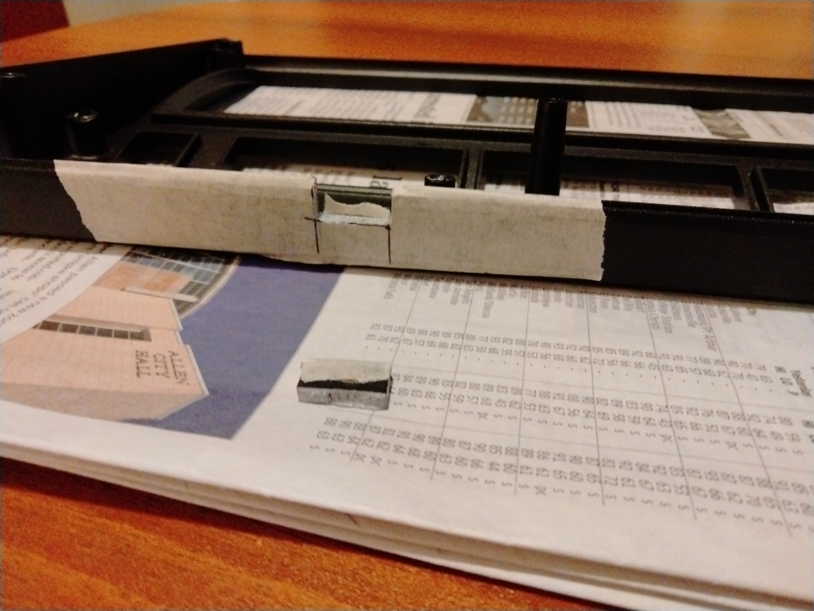
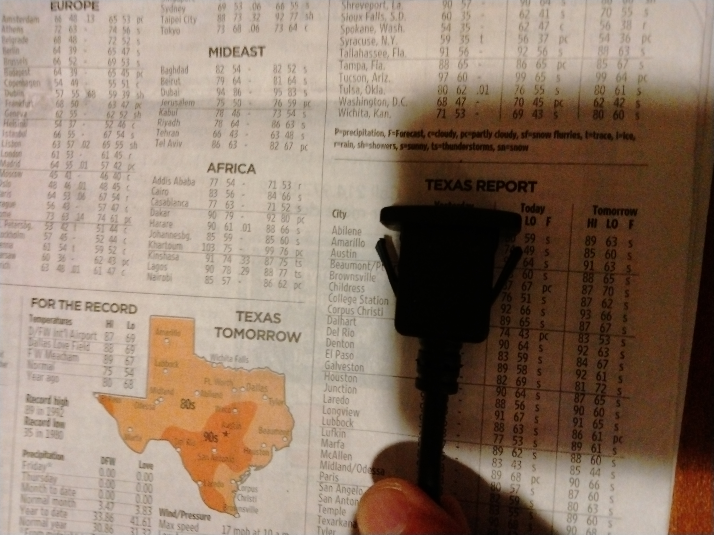
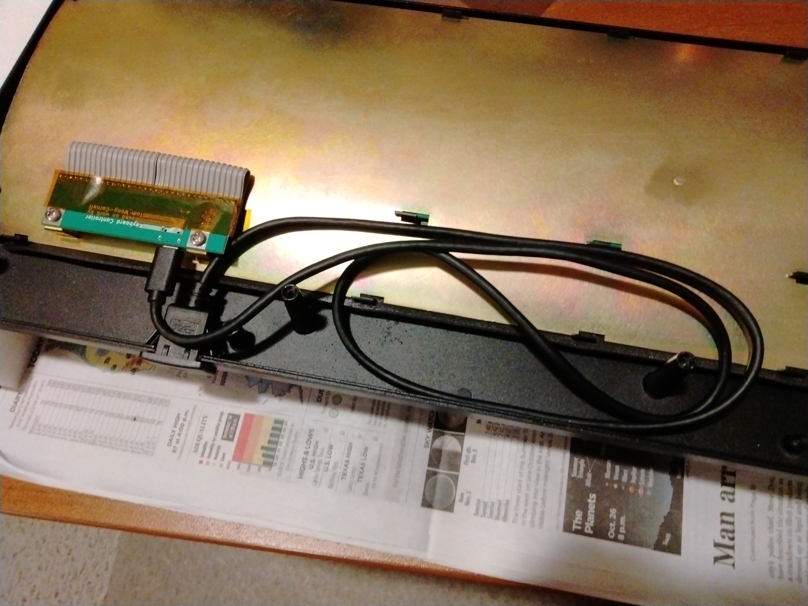
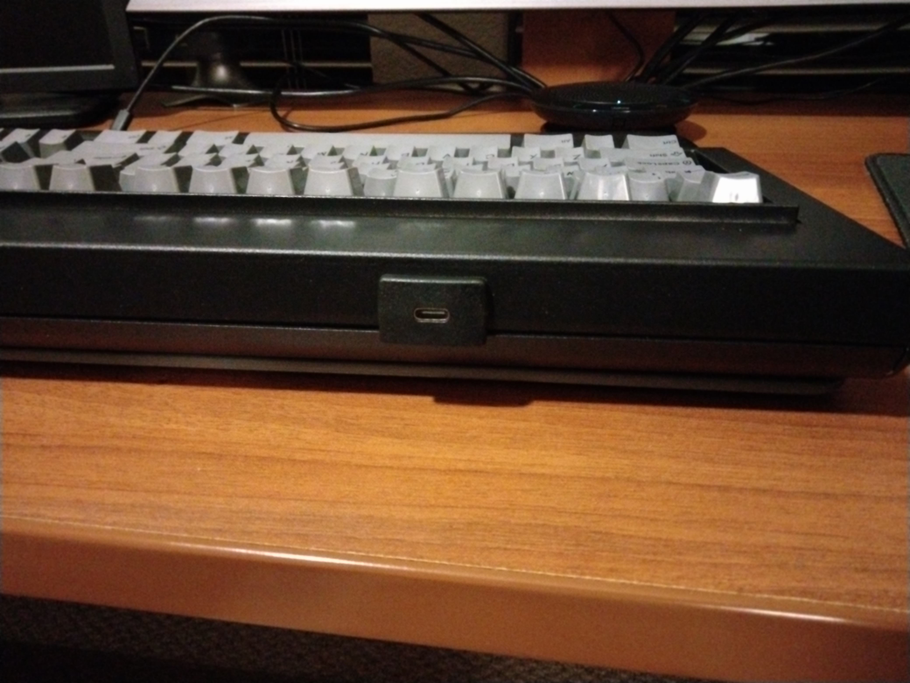
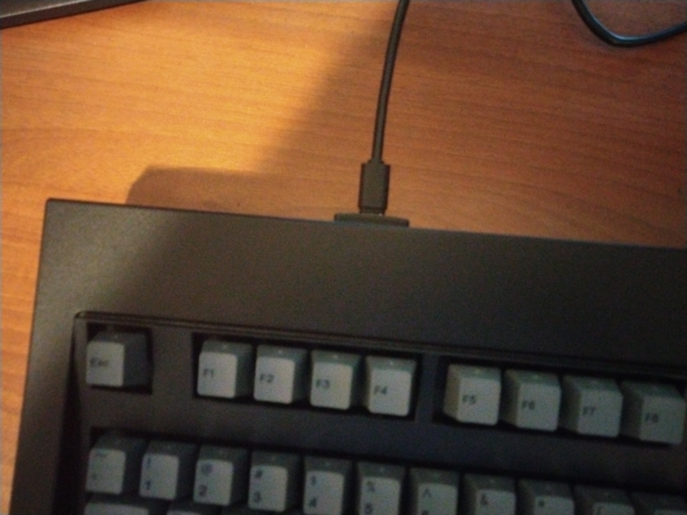

This document shows how I replaced the USB cable built in to my New Model F
Classic F104 keyboard with a USB C port.

I used [this flush mount USB extension](https://www.amazon.com/gp/product/B0B284JR61/ref=ppx_yo_dt_b_asin_title_o01_s00?ie=UTF8&th=1).

Other, similar products are available, but I chose this one because its "plug"
section is shorter than many others.  This gave me more room to run the cable
close to the controller.

Here are the steps that I used.

1. Place the keyboard upside-down, supported at its ends, so that no keys are
   being mashed.  (I used the foam inserts from the shipping box for this purpose.)

1. Remove the 6 screws from the bottom of the keyboard.  (I used an Allen Wrench, from the
   collection that I've accumulated over the years.)  Be sure that the wrench or
   screwdriver that you use fits tightly into the screws; using a wrench or
   bit that is too small can easily strip the holes in the screws.

1. Remove the bottom part of the case.  This will expose the keyboard controller,
   into which the existing USB cable is plugged.

   

1. Unplug the cable from the controller and unscrew the cable clamp from the case.

1. Test the USB extension by plugging it into the controller, plugging the
   original cable into the extension, and testing the keyboard

1. Remove the 4 screws that attach the keyboard's inner assembly to the case and
   remove the inner assembly.  When setting down the inner assembly, ensure that
   the controller is not mashed.

   (I tested the USB extension at this stage, even though I should have done it
   earlier.)

   

1. Use painters tape and a fine point Sharpie to mark the the hole that you will
   cut/file in the case.  Ultimately, the hole should be about 18 millimeters
   wide and 13 millimeters deep, but the **initial** size of the hole should be
   slightly smaller in both dimensions, so that the size can be "fine tuned" with
   a file to ensure that the USB extension fits snugly.

   

1. Use a hacksaw to cut the vertical sides of the hole.

   

1. Use vise grip (or other large) pliers to snap off the resulting "tab."  Bend
   the tab toward the inside of the case, so the exterior powder coating is not
   pulled away from the surface of the case.

   
   

1. The angled "snap-in" tabs on the USB extension are too long for the thickness
   of the keyboard's case.  Use a small wire cutter to trim them.

   
   

1. There is also an small "nub" of plastic on one side of the extension.  Use a
   file to remove this plastic, so that the extension will fit into the
   smallest possible hole.

   

1. Carefully use a file to make the hole just large enough to accomodate the USB
   extension.  Check the fit frequently, so that you don't make the hole too
   large.  Ensure that the two pieces of the case fit together evenly.

   
   
   

1. Reinstall the keyboard's inner assembly, being careful not to over-tighten
   the 4 screws that hold it in place.  (It is easy to strip the threads in the
   aluminum case.)

1. Insert the USB extension into its hole, plug it in to the keyboard controller,
   and route the cable in a way that will not interfere with the case being put
   back together.

   

1. Reassemble the case and enjoy the final result.

  
  
